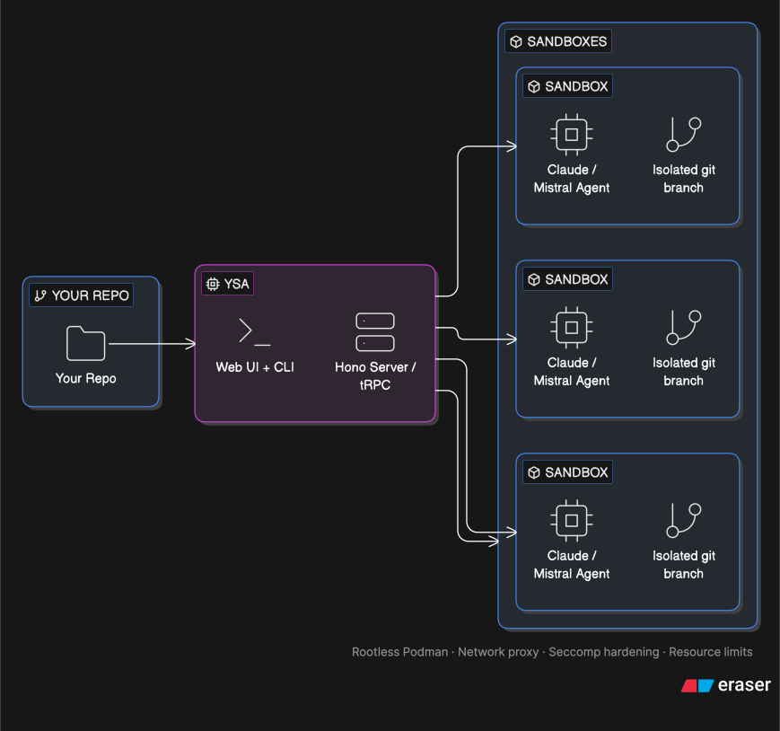

# Your Secure Agent

> **Early development** — this repo is under active development. Expect breaking changes between releases.

**ysa is a container runtime and local dashboard for running AI coding agents safely on your machine.**

You get two things out of the box:
- **A secure container runtime** — every agent runs in an isolated, rootless Podman container with a hardened sandbox, its own git worktree, and optional network policy enforcement
- **A local web dashboard + CLI** — a simple UI to launch tasks, monitor logs, review results, and manage parallel agent sessions

No cloud, no telemetry, no data leaving your machine. Run multiple agents in parallel on the same codebase, each on its own branch, each fully isolated from each other and from your host system.

<p align="center"></p>

> [Detailed architecture diagram](./docs/architecture.svg)

---

## Why ysa?

| Goal | What ysa does |
|---|---|
| **Security** | Every agent runs in a locked-down container: no root, read-only filesystem, syscall whitelist, capability-stripped |
| **Sovereignty** | Runs entirely on your machine. No cloud, no telemetry, no data leaving your network |
| **Productivity** | Run multiple agents in parallel on the same codebase, each on its own branch  |

---

## Features

- **Parallel execution** — run multiple agents simultaneously, each in its own container and git worktree
- **Hardened sandbox** — rootless Podman with defense-in-depth (see [Container security](#container-security))
- **Network policy** — optional outbound traffic control with a local proxy and firewall enforcement
- **Multi-language** — one container image, any runtime: Node.js, Python, Go, Rust, Ruby, PHP, Java, .NET, Elixir, C/C++ (via [mise](https://mise.jdx.dev) + apk)
- **Multi-provider** — Claude Code and Mistral out of the box, extensible adapter interface
- **Self-hosted models** — local/self-hosted model support coming soon
- **Web UI + CLI** — browser dashboard and `ysa` CLI, both talking to the same local server
- **Session resume** — continue or refine a stopped/completed agent session
- **Sandbox shell** — open an interactive session inside the secured container for manual intervention

---

## Requirements

- [Bun](https://bun.sh) 1.2+
- [Podman](https://podman.io) (rootless mode)
- macOS or Linux
- Windows support coming soon

---

## Installation

```bash
git clone https://github.com/ysa-ai/ysa
cd ysa
bun install

# Build the container images (one-time, ~2–3 min)
bun run build:images
```

## Quick start

```bash
# Start the server (opens the web UI at http://localhost:4000)
ysa

# Or run a task directly from the CLI
ysa run "summarize this codebase" --branch main
```

On first launch, the web UI will ask you to set a project root — the directory where your code lives. This is stored locally and never leaves your machine.

## CLI

```bash
ysa                        # Start the web server + UI
ysa run "prompt" [opts]    # Run a task
ysa list                   # List tasks
ysa logs <task-id>         # Stream logs for a task
ysa stop <task-id>         # Stop a running task
ysa teardown               # Remove all worktrees and containers
```

---

## Network policy

Two modes:

- **Unrestricted** — full internet access inside the container
- **Restricted** — all traffic routed through a local MITM proxy. GET-only, no request body, rate limits, outbound byte budget. Enforced at both the proxy and firewall level inside the container network namespace.

---

## Container security

Every container runs directly on the host kernel via rootless Podman — no virtual machine, no hypervisor. The security constraints are enforced at the kernel level:

- `--cap-drop ALL` — strips all Linux process capabilities (no `chown`, no `setuid`, no `net_admin`, no elevated access of any kind)
- `--read-only` — immutable root filesystem; the agent cannot modify system files
- `--security-opt no-new-privileges` — prevents any process inside from gaining elevated privileges
- `--security-opt seccomp=...` — syscall whitelist (~190 allowed out of ~400+); blocks `clone3`, memfd tricks, and other escalation paths
- `--tmpfs /tmp` — writable scratch space is in-memory only
- `--memory 4g --cpus 2 --pids-limit 512` — hard resource limits per container
- Rootless Podman — the container daemon itself runs as an unprivileged user; no process has root on the host at any point

The git `safe-wrapper` shadows `/usr/bin/git` inside the container and strips 38+ dangerous config keys (hooks, filters, SSH command, proxy, credentials). A pre-push guard blocks pushes to any branch except the task's own branch.

### Security test suite

The sandbox is validated by two automated test suites — run them to verify the hardening on your own machine:

```bash
# Run the full security suite (container sandbox + network proxy)
bash container/tests/security-test.sh

# Container sandbox only (no proxy required)
bash container/tests/security-test.sh --skip-network
```

- **`attack-test.sh`** — 155 tests across 38 attack categories: privilege escalation, filesystem escapes, git hook injection, credential theft, signal abuse, and more. Runs inside the container.
- **`network-proxy-test.sh`** — 60 tests for the MITM proxy and firewall enforcement: exfiltration attempts, method bypasses, rule verification.

---

## Language support

ysa uses [mise](https://mise.jdx.dev) as a universal toolchain manager — one container image, any language runtime. Select languages in Settings and ysa provisions the runtimes into a shared cache volume at config time, so containers get the right toolchain without needing network access at task runtime.

| Language | Runtime |
|---|---|
| Node.js / Bun | mise (`node@22`) |
| Python | mise (`python@3.13`) |
| Go | mise (`go@latest`) |
| Rust | mise (`rust@latest`) |
| .NET | mise (`dotnet@8`) |
| Elixir | apk (`elixir` + erlang) |
| Ruby | apk (`ruby`) |
| PHP | apk (`php`) |
| Java (Maven) | apk (`openjdk21-jdk` + `maven`) |
| Java (Gradle) | apk (`openjdk21-jdk` + `gradle`) |
| C / C++ | apk (`g++`) |

---

## Configuration

All configuration is stored in `~/.ysa/core.db` (SQLite). No environment files needed.

Settings managed through the web UI:
- **Project root** — directory where worktrees are created
- **Default provider / model** — pre-fill provider and model selection
- **Default network policy** — Unrestricted or Restricted
- **Languages** — select runtimes to provision into the shared mise cache
- **Preferred terminal** — for the Sandbox Shell feature

---

## Contributing

PRs welcome. See [CLAUDE.md](CLAUDE.md) for code conventions.

---

## License

[Elastic License 2.0](LICENSE) — free to use internally and modify, including within commercial companies. You may not offer ysa as a hosted or managed service to third parties.

### Container runtime

The container security layer — `container/seccomp.json`, `container/git-safe-wrapper.sh`, `container/sandbox-run.sh`, `container/network-proxy.ts`, and related scripts — is intentionally transparent. Read them, audit them, run the test suites against your own setup. Security that can't be verified shouldn't be trusted.

The plan is to extract this runtime into its own standalone repository under a permissive license (MIT or Apache 2.0), so anyone can build their own orchestration layer on top of it freely. If you're interested in doing that before then, the container artifacts are the right starting point.

If you find a gap or want to contribute a hardening improvement, PRs are welcome.
