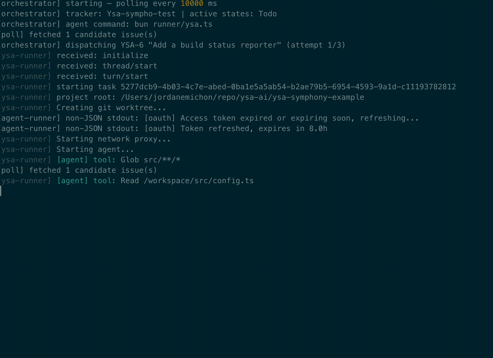

# Your Secure Agent

[](https://www.npmjs.com/package/@ysa-ai/ysa)
[](LICENSE)
[](https://open.ysa.run)

**[Docs](https://open.ysa.run/docs/) · [CLI Reference](https://open.ysa.run/docs/cli/) · [API Reference](https://open.ysa.run/docs/api/) · [Guides](https://open.ysa.run/docs/guides/first-task)**

> **Early development** — this repo is under active development. Expect breaking changes between releases.

**ysa is a secure container runtime for AI coding agents — a CLI and SDK, nothing else.**

Every agent runs in an isolated, rootless Podman container with a hardened sandbox, its own git worktree, and optional network policy enforcement. No cloud, no telemetry, no data leaving your machine.



---

## Why ysa?

| Goal | What ysa does |
|---|---|
| **Security** | Every agent runs in a locked-down container: no root, read-only filesystem, syscall whitelist, capability-stripped |
| **Sovereignty** | Runs entirely on your machine. No cloud, no telemetry, no data leaving your network |
| **Composability** | Use `runTask()` as a primitive to build any orchestration layer on top |

---

## Features

- **Hardened sandbox** — rootless Podman with defense-in-depth (see [Container security](#container-security))
- **Network policy** — optional outbound traffic control with a local proxy and firewall enforcement
- **Multi-language** — one container image, any runtime: Node.js, Python, Go, Rust, Ruby, PHP, Java, .NET, Elixir, C/C++ (via [mise](https://mise.jdx.dev) + apt)
- **Multi-provider** — Claude Code and Mistral out of the box, extensible via `registerProvider()`
- **SDK** — `import { runTask } from "@ysa-ai/ysa/runtime"` — build your own orchestration layer
- **Session resume** — continue or refine a stopped/completed agent session
- **Sandbox shell** — open an interactive session inside the secured container for manual intervention

---


## Requirements

- [Podman](https://podman.io) 5.x+ (rootless mode)
- macOS or Linux
- Windows support coming soon

---

## Installation

```bash
npm install -g @ysa-ai/ysa

# First-time setup: preflight checks, CA cert, container images, network hooks
ysa setup
```

`ysa setup` will verify Podman is installed and configured correctly, then build the container images (~2–3 min on first run). Re-run it any time to check your environment.

**From source:**

```bash
git clone https://github.com/ysa-ai/ysa
cd ysa
bun install
bun run build
ysa setup
```

## Quick start

```bash
# From inside any git repo — no config required
ysa run "summarize this codebase"

# Iterate on the result
ysa refine <task-id> "now write tests for it"
```

## CLI

```bash
ysa setup                          # First-run setup (preflight, images, CA cert, hooks)
ysa run "prompt" [opts]            # Run a task
ysa refine <task-id> "prompt"      # Continue/iterate on a completed task
ysa list                           # List tasks
ysa logs <task-id>                 # Stream logs for a task
ysa stop <task-id>                 # Stop a running task
ysa teardown <task-id>             # Remove task resources (container + worktree)
ysa runtime <add|remove|list|detect> [tool]  # Manage per-project runtimes
```

**`ysa run` options:**

| Flag | Default | Description |
|---|---|---|
| `-b, --branch <name>` | auto | Git branch name for the worktree |
| `-m, --max-turns <n>` | `60` | Max agent turns |
| `-n, --network <policy>` | `none` | Network policy: `none` \| `strict` |
| `-q, --quiet` | — | Progress only, no agent output |
| `-v, --verbose` | — | Show full log including tool calls |
| `-i, --interactive` | — | Live terminal session inside the sandbox |
| `--no-commit` | — | Prevent agent from committing (useful for review/analysis tasks) |

---

## Network policy

Two modes:

- **Unrestricted** — full internet access inside the container
- **Restricted** — all traffic routed through a local MITM proxy. GET-only, no request body, rate limits, outbound byte budget. Enforced at both the proxy and firewall level inside the container network namespace.

---

## Container security

Every container runs directly on the host kernel via rootless Podman — no virtual machine, no hypervisor. The security constraints are enforced at the kernel level:

- `--cap-drop ALL` — strips all Linux process capabilities (no `chown`, no `setuid`, no `net_admin`, no elevated access of any kind)
- `--read-only` — immutable root filesystem; the agent cannot modify system files
- `--security-opt no-new-privileges` — prevents any process inside from gaining elevated privileges
- `--security-opt seccomp=...` — syscall whitelist (~190 allowed out of ~400+); blocks `clone3`, memfd tricks, and other escalation paths
- `--tmpfs /tmp` — writable scratch space is in-memory only
- `--memory 4g --cpus 2 --pids-limit 512` — hard resource limits per container
- Rootless Podman — the container daemon itself runs as an unprivileged user; no process has root on the host at any point

The git `safe-wrapper` shadows `/usr/bin/git` inside the container and strips 38+ dangerous config keys (hooks, filters, SSH command, proxy, credentials). A pre-push guard blocks pushes to any branch except the task's own branch.

### Security test suite

The sandbox is validated by two automated test suites — run them to verify the hardening on your own machine:

```bash
# Run the full security suite (container sandbox + network proxy)
bash container/tests/security-test.sh

# Container sandbox only (no proxy required)
bash container/tests/security-test.sh --skip-network
```

- **`attack-test.sh`** — 155 tests across 38 attack categories: privilege escalation, filesystem escapes, git hook injection, credential theft, signal abuse, and more. Runs inside the container.
- **`network-proxy-test.sh`** — 60 tests for the MITM proxy and firewall enforcement: exfiltration attempts, method bypasses, rule verification.

---

## Language support

ysa uses [mise](https://mise.jdx.dev) as a universal toolchain manager — one container image, any language runtime. Configure runtimes per project with `ysa runtime` and ysa provisions the toolchain into the sandbox at task start:

```bash
ysa runtime detect          # auto-detect languages in the project
ysa runtime add node@22     # add a specific runtime
ysa runtime list            # show configured runtimes
```

Runtimes are stored in `.ysa.toml` at the project root.

| Language | Runtime |
|---|---|
| Node.js / Bun | mise (`node@22`) |
| Python | mise (`python@3.13`) |
| Go | mise (`go@1`) |
| Rust | mise (`rust@1`) |
| .NET | mise (`dotnet@8`) |
| Ruby | mise (`ruby@3.3`) |
| Java (Maven) | mise (`java@21` + `maven@3`) |
| Java (Gradle) | mise (`java@21` + `gradle@8`) |
| Elixir | mise (`elixir@1.18-otp-26`) + apt (`erlang`) |
| PHP | apt (`php-cli`) |
| C / C++ | apt (`g++`) |

---

## Configuration

Global config is stored in `~/.ysa/` (token file, CA cert). No environment files needed.

Per-project runtime config lives in `.ysa.toml` at the project root (managed via `ysa runtime`).

---

## Contributing

PRs welcome. See [CLAUDE.md](CLAUDE.md) for code conventions.

---

## License

[Apache License 2.0](LICENSE) — use it, modify it, build on it freely.

The container security layer — `container/seccomp.json`, `container/git-safe-wrapper.sh`, `container/sandbox-run.sh`, `container/network-proxy.ts`, and related scripts — is intentionally transparent. Read them, audit them, run the test suites against your own setup. Security that can't be verified shouldn't be trusted.

If you find a gap or want to contribute a hardening improvement, PRs are welcome.
